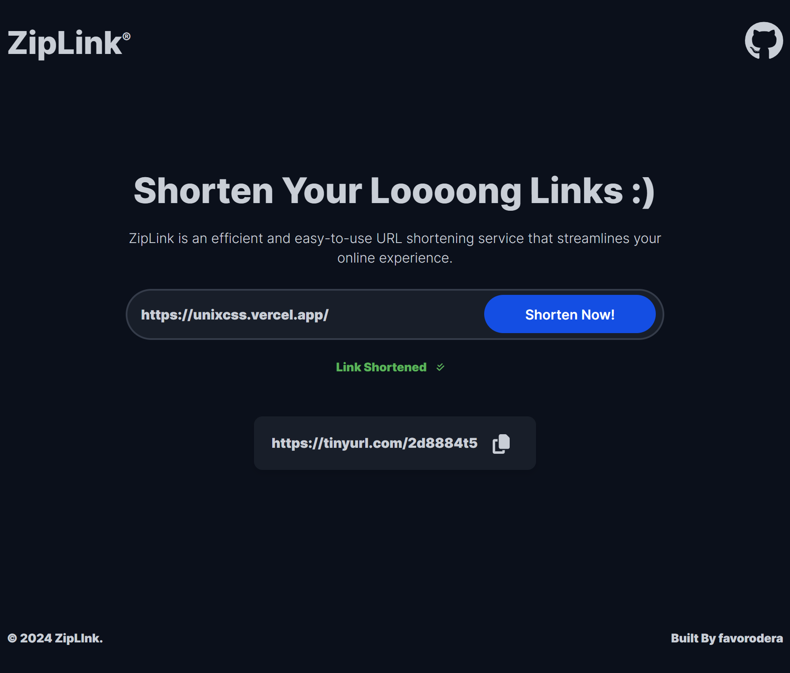

# ZipLink - A Url Shortening Tool



###

###

## Description:

Tired of sharing long and messy URLs? ZipLink to the rescue! ⚡ This user-friendly React application lets you quickly and easily shorten lengthy URLs, making them perfect for social media, emails, and text messages. No more character limitations or frustration – ZipLink keeps your links concise and shareable.

###

###

## Features (More Coming):

- **Effortless Shortening:** Simply paste your long URL and ZipLink does the magic with the click of a button Instantly generating a clean and compact shortened link.
- **Intuitive Interface** Enjoy a modern and user-friendly design that makes shortening URLs a breeze. Clear instructions and straightforward navigation make it simple for anyone to use.
- **Easy Link Copying** No need to drag your mouse or "press and hold" to copy your shortened links... Juuust click the copy button and its all yours!

###

###

## Benefits:

- **Enhanced Sharing:** Share your shortened links on social media, emails, and text messages without any hassle.
- **Improved User Experience:** Provide a more convenient way for users to access your content.

###

###

## Getting Started Locally:

- Clone the repository:

```bash
git clone https://github.com/your-username/ZipLink.git
```

- Install dependencies:

```bash
pnpm install
```

- Start the development server:

```bash
pnpm dev
```

###

###

## Contribute and Share:

- ZipLink is an open-source project! Feel free to contribute by submitting pull requests.
- Report any bugs or suggest improvements through GitHub issues.

###
